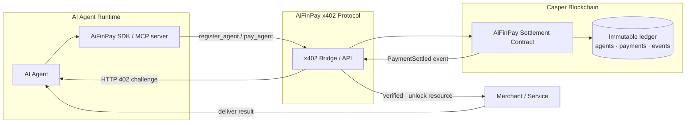
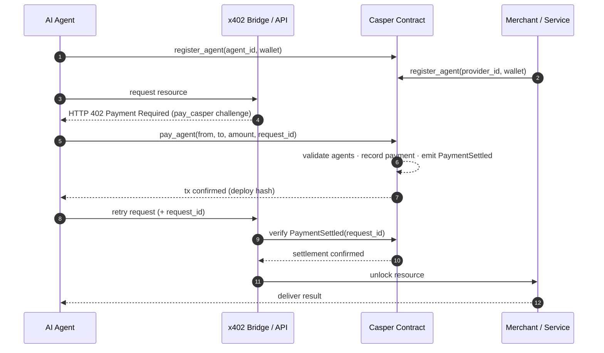

# Architecture

AiFinPay is payment infrastructure for autonomous AI agents. This repository is
the **Casper settlement layer**: a Rust → Wasm smart contract that records
agent-to-agent payments immutably on Casper, plus the x402 bridge, SDK examples,
and MCP server that let AI agents settle on it.

> For low-level storage layout, error codes, and named keys, see
> [`docs/ARCHITECTURE.md`](docs/ARCHITECTURE.md).

## Components

## Payment lifecycle (sequence)

## Why Casper

- **Predictable, low fees** for high-frequency machine-to-machine micropayments.
- **Deterministic Wasm execution** (Rust) — auditable settlement logic.
- **Native on-chain events** (`PaymentSettled`) give merchants a cryptographic
  proof of payment without a trusted intermediary.
- **Idempotent settlement** keyed by `request_id` — safe retries, no double spend.

## Multi-chain context

Casper is one settlement backend in the broader AiFinPay protocol, which also
runs on Solana and multiple EVM networks. Each chain shares the same economic
model; Casper adds a low-fee, high-throughput option tuned for agentic workloads.
