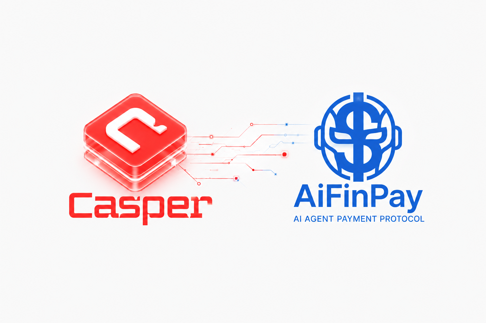
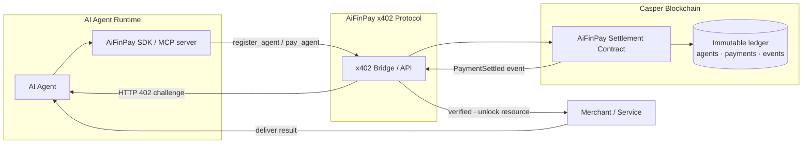
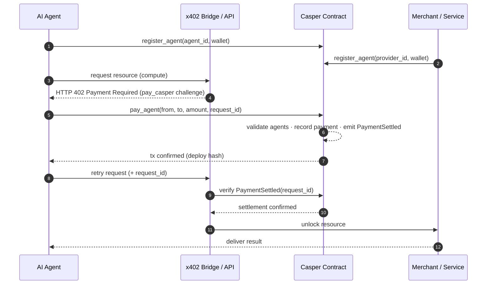
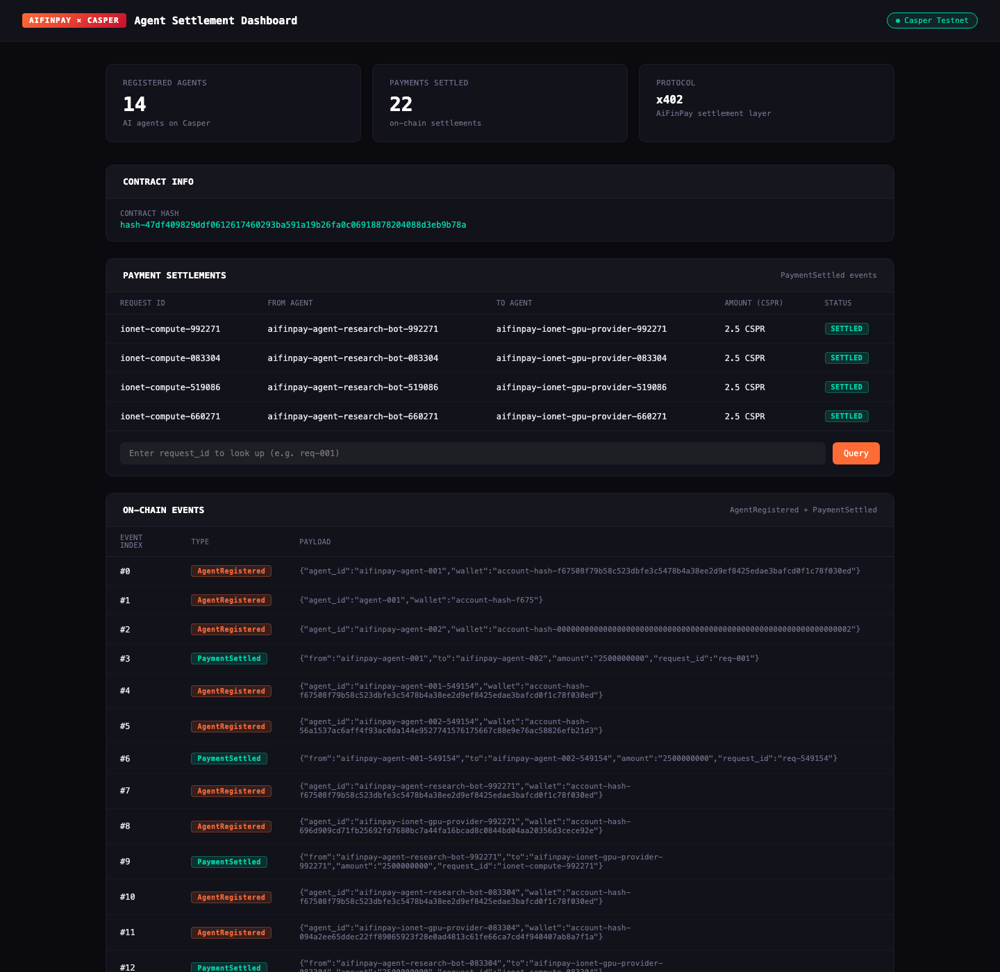

<div align="center">



# AiFinPay × Casper

### Payment infrastructure for autonomous AI agents — settled on Casper

Autonomous AI agents need to pay each other and pay for services — compute, data, APIs — with no human in the loop. **AiFinPay** is the payment protocol (x402); **Casper** is the on-chain settlement layer. This repository is the live Casper settlement contract, the x402 bridge, SDK examples, and an MCP server that lets AI agents settle payments on Casper.

[](https://github.com/AiFinPay/casper-contract/actions/workflows/ci.yml)
[](https://github.com/AiFinPay/casper-contract/actions/workflows/codeql.yml)
[](LICENSE)
[](https://cspr.live/contract/9903a5e3948e799196df54b17270bc6769338ac1cc36c9eb47e113f88d23f019)
[](https://www.rust-lang.org/)
[](https://nodejs.org/)
[](demo/casper-mcp.mjs)
[](https://cspr.build/)

[Quick Start](#quick-start) · [Architecture](#architecture) · [Payment Flow](#payment-flow) · [Sample Transactions](#sample-transactions) · [Demo](#demo-video) · [Roadmap](#roadmap)

</div>

---

## Table of Contents

- [Introduction](#introduction)
- [Problem](#problem)
- [Solution](#solution)
- [Features](#features)
- [Architecture](#architecture)
- [Why Casper](#why-casper)
- [Payment Flow](#payment-flow)
- [Repository Structure](#repository-structure)
- [Quick Start](#quick-start)
- [Installation & Configuration](#installation--configuration)
- [Local Development](#local-development)
- [Deploying the Contract](#deploying-the-contract)
- [Casper Mainnet Deployment](#-casper-mainnet-deployment)
- [Casper Testnet Deployment](#casper-testnet-deployment)
- [Contract Package Hash](#contract-package-hash)
- [Sample Transactions](#sample-transactions)
- [SDK & API Examples](#sdk--api-examples)
- [Environment Variables](#environment-variables)
- [Testing Instructions](#testing-instructions)
- [Screenshots](#screenshots)
- [Demo Video](#demo-video)
- [Roadmap](#roadmap)
- [Security](#security)
- [Contributing](#contributing)
- [License](#license)
- [Acknowledgements](#acknowledgements)
- [Casper Agentic Buildathon](#casper-agentic-buildathon)
- [Useful Links](#useful-links)

---

## Introduction

AiFinPay is payment infrastructure for the machine economy. As autonomous AI agents begin to buy compute, data, and API access on their own, they need a way to **pay and be paid** with a verifiable, non-custodial settlement record. AiFinPay provides that as a protocol layer over [HTTP 402](https://en.wikipedia.org/wiki/HTTP_402) (x402), and **this repository implements the Casper settlement backend**: a Rust → Wasm smart contract that gives every agent an on-chain identity and records every payment permanently.

## Problem

Agent-to-agent and agent-to-service commerce needs three things that today's payment rails don't provide together:

1. **Identity** — a stable, verifiable on-chain identity for each agent.
2. **A payment protocol** — a machine-native way to request and authorize payment (no checkout page, no human).
3. **Settlement proof** — an immutable, independently verifiable record that a payment happened.

Card rails and custodial wallets assume a human and a browser. Agents need programmatic settlement with cryptographic proof — at micropayment scale and micropayment cost.

## Solution

AiFinPay closes the loop:

- **x402 protocol** — a service returns `HTTP 402 Payment Required`; the agent settles on-chain and retries with proof.
- **Casper settlement contract** — agents `register_agent` for an on-chain identity, then `pay_agent` to settle. Every settlement emits a `PaymentSettled` event.
- **Idempotent settlement** — payments are keyed by `request_id`, so retries are safe and double-settlement is impossible.
- **MCP server** — AI agents (e.g. Claude via Claude Code / Claude Desktop) settle on Casper as a native tool call.

## Features

- 🧾 **On-chain agent registry** — `register_agent(agent_id, wallet)` with an `AgentRegistered` event.
- 💸 **Verifiable settlement** — `pay_agent(from, to, amount, request_id)` emits `PaymentSettled`, permanently recorded on Casper.
- 🔁 **Idempotent by design** — duplicate `request_id` is rejected (no double spend).
- 🌐 **x402 bridge** — a reference compute gate that enforces `HTTP 402` and verifies settlement on-chain before releasing a resource.
- 🤖 **MCP integration** — drive settlements directly from an AI agent runtime.
- 📊 **Live dashboard** — reads Casper RPC directly to show settlement counts and records.
- 🦀 **Minimal, auditable Rust contract** — deterministic Wasm execution.

## Architecture



Full storage layout, named keys, and error codes are in [`docs/ARCHITECTURE.md`](docs/ARCHITECTURE.md). A component + lifecycle overview is in [`ARCHITECTURE.md`](ARCHITECTURE.md).

## Why Casper

- **Predictable, low fees** for high-frequency machine-to-machine micropayments.
- **Deterministic Wasm execution** (Rust) — settlement logic is auditable and small.
- **Native on-chain events** (`PaymentSettled`) give merchants cryptographic proof of payment without a trusted intermediary.
- **Clean account / identity model** that fits agent registries well.
- **Idempotent settlement** keyed by `request_id` — safe retries, no double spend.

## Payment Flow



## Repository Structure

```text
casper-contract/
├── src/                     # Rust → Wasm settlement contract
│   └── main.rs              #   register_agent · pay_agent · get_payment_count
├── demo/                    # Node.js: agent, x402 bridge, MCP server, dashboard
│   ├── agent-compute-demo.js  # ⭐ AI agent buys compute, settles on Casper
│   ├── compute-bridge.js      # x402 gate — verifies settlement on-chain
│   ├── casper-mcp.mjs         # MCP server for AI-agent-driven settlement
│   ├── deploy.js · keygen.js  # deploy + keypair generation
│   ├── dashboard.html         # live settlement dashboard
│   └── .env.example
├── examples/                # Copy-paste integration examples
├── scripts/                 # build / deploy / demo wrappers
├── docs/                    # ARCHITECTURE · DEPLOYMENT · DEMO_VIDEO
├── .github/                 # CI, CodeQL, Dependabot, issue/PR templates
├── Cargo.toml               # aifinpay-casper (Rust contract)
├── Makefile                 # make setup / build / deploy / agent-demo
└── SUBMISSION.md            # Buildathon submission summary
```

## Quick Start

```bash
# 1. Clone
git clone https://github.com/AiFinPay/casper-contract.git
cd casper-contract

# 2. One-time setup (Rust wasm target + Node deps)
make setup

# 3. Build the contract to Wasm
make build

# 4. Generate a keypair, then fund it at the faucet
make keygen
#    → paste the account hash at https://testnet.cspr.live/tools/faucet, wait ~2 min

# 5. Run the headline demo: AI agent buys compute, settled on Casper
make agent-demo
```

> The contract is **already deployed** on Casper testnet, so you can run the demo against the live contract hash without deploying your own. To deploy your own copy, use `make deploy`.

## Installation & Configuration

**Prerequisites:** [Rust](https://rustup.rs/) (stable) with the `wasm32-unknown-unknown` target, and [Node.js](https://nodejs.org/) ≥ 18.

```bash
# Rust toolchain (contract)
rustup target add wasm32-unknown-unknown

# Node toolchain (demo / SDK / MCP)
cd demo && npm install && cp .env.example .env
```

Set `CONTRACT_HASH` in `demo/.env` after deploying (or use the live hash below).

## Local Development

```bash
make fmt        # format Rust
make clippy     # lint (warnings as errors)
make test       # contract tests
make demo       # basic register + settle flow
make agent-demo # AI agent buys compute (x402 → Casper)
make mcp        # start the Casper MCP server
make dashboard  # serve the live dashboard
```

## Deploying the Contract

```bash
make build      # target/wasm32-unknown-unknown/release/aifinpay_casper.wasm
make deploy     # deploys via demo/deploy.js, prints the new CONTRACT_HASH
```

Save the printed `CONTRACT_HASH` into `demo/.env`. Full walkthrough: [`docs/DEPLOYMENT.md`](docs/DEPLOYMENT.md).

## 🟢 Casper Mainnet Deployment

The settlement contract is **live on Casper Mainnet** — not only testnet. Every entry point below has been exercised on mainnet with real CSPR.

| Field | Value |
|-------|-------|
| **Network** | `casper` (Casper 2.0 mainnet) |
| **Contract hash** | `contract-9903a5e3948e799196df54b17270bc6769338ac1cc36c9eb47e113f88d23f019` |
| **Package hash** | `hash-7ad34a204952eef63d5dcf5159fb7d009e85dea4f49cbdf73dde190652dfa375` |
| **Explorer** | [cspr.live mainnet](https://cspr.live/contract/9903a5e3948e799196df54b17270bc6769338ac1cc36c9eb47e113f88d23f019) |
| **Install deploy** | [`0d560c62…`](https://cspr.live/deploy/0d560c62679d109525ee8b2b1ce1a275cba7deff50a90352f8b4aabf4f070386) |

### Live mainnet settlement (real value moved)

A full agent-to-agent settlement executed on mainnet — two agents registered, a payment settled on-chain, and real CSPR delivered to the provider's wallet:

| Action | Deploy | Explorer |
|--------|--------|----------|
| Register agent (buyer) | `aee06f58…` | [view](https://cspr.live/deploy/aee06f58a2cc9c2d20d04e8d931077a772750060dae795cb6b22912d3c1762fb) |
| Register agent (provider) | `4f06da16…` | [view](https://cspr.live/deploy/4f06da161a282897e7afab3f6529d22307e994d197f04b52e02ee25324111f84) |
| **PaymentSettled** (`pay_agent`) | `80df5895…` | [view](https://cspr.live/deploy/80df58959f81d99d717027cdc069e95a3464d867150184b0f05312de6c6eb6d7) |
| Value transfer (2.5 CSPR → provider) | `564f19be…` | [view](https://cspr.live/deploy/564f19be2c89140a6dda9e97e4440d49890cf8df5b678b00bd0c625c6d975f3a) |

Reproduce on mainnet with a funded key at `demo/keys-mainnet/secret_key.pem`: `node demo/deploy-mainnet.js` then `node demo/demo-mainnet.js`.

## Casper Testnet Deployment

| Field | Value |
|-------|-------|
| **Network** | `casper-test` (Casper 2.0) |
| **Public RPC** | `https://node.testnet.casper.network/rpc` |
| **Explorer** | [cspr.live testnet](https://testnet.cspr.live/contract/47df409829ddf0612617460293ba591a19b26fa0c06918878204088d3eb9b78a) |
| **Language** | Rust → WebAssembly (`casper-contract 5.1.1`, `casper-types 6.1.0`) |

### Entry Points

| Entry Point | Args | Description |
|-------------|------|-------------|
| `register_agent` | `agent_id: String, wallet: String` | Register an AI agent on-chain → `AgentRegistered` |
| `pay_agent` | `from_agent: String, to_agent: String, amount: U512, request_id: String` | Settle a payment → `PaymentSettled` |
| `get_payment_count` | — | Total settled payments |

### Events

- `AgentRegistered` — `agent_id`, `wallet`
- `PaymentSettled` — `from`, `to`, `amount` (motes), `request_id`

## Contract Package Hash

```text
hash-47df409829ddf0612617460293ba591a19b26fa0c06918878204088d3eb9b78a
```

[View on cspr.live →](https://testnet.cspr.live/contract/47df409829ddf0612617460293ba591a19b26fa0c06918878204088d3eb9b78a)

## Sample Transactions

Real transactions from the agent-compute demo on `casper-test`:

| Action | Deploy | Explorer |
|--------|--------|----------|
| Register agent (buyer) | `d4b7d0ad…27d23e0` | [view](https://testnet.cspr.live/deploy/d4b7d0ad3b59a97a1165eab1dbc36dbee56ccf8a4bc48f3507071682427d23e0) |
| Register agent (provider) | `6c41c885…faac4e8` | [view](https://testnet.cspr.live/deploy/6c41c8858f95af24afaf1267dcb8ced93c654f9a8bddfc722c6638825faac4e8) |
| **PaymentSettled** (`pay_agent`) | `0b55b516…ffb0137` | [view](https://testnet.cspr.live/deploy/0b55b516058a3482beef0dac2d6997d84b402f82f71a97b3098e2aadaffb0137) |

Reproduce them yourself: `make agent-demo` (with a funded key at `demo/keys/secret_key.pem`).

## SDK & API Examples

Small, runnable examples live in [`examples/`](examples/):

- [`register-agent.js`](examples/register-agent.js) — register an agent (`register_agent`)
- [`pay-agent.js`](examples/pay-agent.js) — settle a payment (`pay_agent`)
- [`ai-agent-buys-compute.md`](examples/ai-agent-buys-compute.md) — the headline x402 → Casper flow
- [`merchant-integration.md`](examples/merchant-integration.md) — gate an endpoint behind on-chain settlement
- [`mcp-server.md`](examples/mcp-server.md) — drive settlements from Claude via MCP

The reference x402 gate is [`demo/compute-bridge.js`](demo/compute-bridge.js); the AI agent client is [`demo/agent-compute-demo.js`](demo/agent-compute-demo.js).

## Environment Variables

Configure in `demo/.env` (see [`demo/.env.example`](demo/.env.example)):

| Variable | Default | Description |
|----------|---------|-------------|
| `NODE_URL` | `https://node.testnet.casper.network/rpc` | Casper RPC endpoint |
| `NETWORK_NAME` | `casper-test` | Casper network name |
| `KEYS_DIR` | `./keys` | Directory holding the signing key |
| `CONTRACT_HASH` | — | Deployed contract hash (`hash-…`) |
| `COMPUTE_UPSTREAM_URL` | _(optional)_ | Real OpenAI-compatible compute endpoint |
| `COMPUTE_API_KEY` | _(optional)_ | API key for the upstream provider |

> **Never commit** `.env`, keys, or keypairs. `.gitignore` blocks `demo/.env` and `demo/keys/`, but always double-check before pushing.

## Testing Instructions

```bash
make test                                    # Rust contract tests
cargo clippy --all-targets -- -D warnings    # lint
cargo fmt --all -- --check                   # format check
cd demo && node test-mcp.mjs                 # MCP server smoke test
```

End-to-end: run `make agent-demo` against the live contract and confirm the printed `PaymentSettled` deploy resolves to **Success** on cspr.live.

## Screenshots

**Agent Settlement Dashboard** — a live view of the deployed testnet contract: registered agents, on-chain settlements, per-payment receipts, and the raw event log, all read straight from the Casper RPC. Run it locally with `cd demo && node serve-dashboard.js`.



## Demo Video

The narrated walkthrough script is in [`docs/DEMO_VIDEO.md`](docs/DEMO_VIDEO.md) — an autonomous AI agent buys compute and settles it on Casper testnet in ~90 seconds, ending on the on-chain settlement proof.

> 📹 Video link: _to be added_.

## Roadmap

See [`ROADMAP.md`](ROADMAP.md) for the full plan. Highlights:

- ✅ Live Casper settlement contract + end-to-end agentic payment flow + MCP server.
- 🔜 USDC settlement, a typed `@aifinpay/casper` SDK on npm, hosted x402 gateway.
- 🧭 Casper Mainnet, programmable spend limits, on-chain agent reputation.

## Security

- **CodeQL**, **Dependabot**, and **secret scanning with push protection** run on this repository.
- Report vulnerabilities privately — see [`SECURITY.md`](SECURITY.md). **Do not** open a public issue for security problems.

## Contributing

Contributions are welcome — see [`CONTRIBUTING.md`](CONTRIBUTING.md) and our [`CODE_OF_CONDUCT.md`](CODE_OF_CONDUCT.md). Use the issue and PR templates; CI (build, lint, CodeQL) must pass.

## License

[MIT](LICENSE) © 2026 AiFinPay.

## Acknowledgements

- [Casper Network](https://casper.network/) and the **Casper Agentic Buildathon**.
- The [Model Context Protocol](https://modelcontextprotocol.io/) and Claude for agent-driven settlement.
- [`casper-js-sdk`](https://www.npmjs.com/package/casper-js-sdk) and the Casper Rust contract toolchain.

## Casper Agentic Buildathon

This repository is AiFinPay's submission to the **Casper Agentic Buildathon** — a fully functional MVP on Casper testnet with a live contract, verifiable on-chain settlements, demo + testing instructions, and CI/security automation. See [`SUBMISSION.md`](SUBMISSION.md).

## Useful Links

- 🌐 Website — https://aifinpay.io
- 💻 Organization — https://github.com/AiFinPay
- 🔎 Contract on cspr.live — [testnet explorer](https://testnet.cspr.live/contract/47df409829ddf0612617460293ba591a19b26fa0c06918878204088d3eb9b78a)
- 🚰 Casper testnet faucet — https://testnet.cspr.live/tools/faucet
- 📚 Casper docs — https://docs.casper.network/
